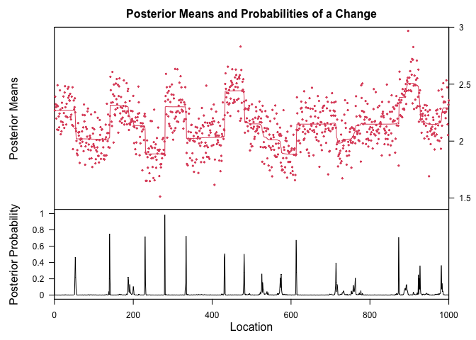
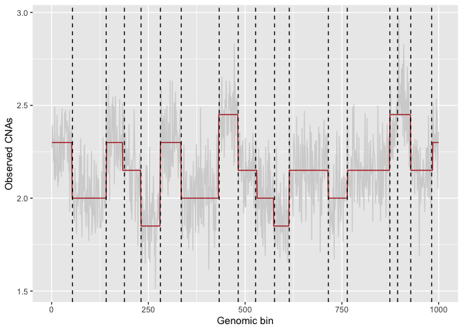

# BayesCNA

In this script, we give an example output of BayesCNA so that the user
can validate that the program is running as it should. For more details
of the method, we refer the reader to our preprint:
<https://www.biorxiv.org/content/10.1101/2025.09.22.677749v1>

## Installation of packages and settings

Below, we provide installation instructions for the BCP package. If BCP
is already installed on your machine, this step can be skipped.

``` r
library(devtools) # version 2.4.5
```

    ## Warning: package 'devtools' was built under R version 4.5.1

    ## Loading required package: usethis

    ## Warning: package 'usethis' was built under R version 4.5.1

``` r
devtools::install_github("swang87/bcp")
```

    ## Using GitHub PAT from the git credential store.

    ## Skipping install of 'bcp' from a github remote, the SHA1 (a585b8e9) has not changed since last install.
    ##   Use `force = TRUE` to force installation

The packages below are required to run BayesCNA and import its
functions. Version numbers used are provided as comments.

``` r
# load required packages
library(ggplot2)    # version 3.5.1
library(magrittr)   # version 2.0.3
library(bcp)        # version 4.0.3
```

    ## Loading required package: grid

``` r
library(pracma)     # version 2.4.4
```

    ## Warning: package 'pracma' was built under R version 4.5.1

    ## 
    ## Attaching package: 'pracma'

    ## The following objects are masked from 'package:magrittr':
    ## 
    ##     and, mod, or

``` r
# load BayesCNA functions
source("../segmentation.R")
```

## Loading the data

For illustration purposes, we have simulated an artificial CNA profile
with added Gaussian noise, with purity*p* = 0.15 and *n* = 1000 genomic
bins. This provides us with a ground truth for evaluation. The simulated
data contains the true copy number profile (scaled by the purity) and
the observed (noisy) copy number profiles:

``` r
example.data <- readRDS("example_data.RData")
true.CNAs <- as.numeric(example.data$segment) # true copy number profile
observed.CNAs <- as.numeric(example.data$CN) # observed (noisy) copy number profile
```

Below we plot the data. The red signal indicates the true copy number
profile.

``` r
plot.simulated.data <- \(dataset) {
  N.features <- length(dataset$CN)
  data.frame(
    signal = c(dataset$CN),
    index = rep(1:N.features)
  ) %>% ggplot(aes(x = index, y = signal)) + geom_line(color = "lightgray") +
    geom_line(data = data.frame(index = 1:N.features, signal = dataset$segment %>% as.numeric), color = "firebrick") +
    labs(x = "Genomic bin", y = "Observed CNAs")
}

plot.simulated.data(example.data)
```


BayesCNA works with *any user provided binned genomic data*. However, a
key assumption of the BCP model is constant Gaussian noise so it is
recommended to process the data (e.g correct for GC and mappability
bias) to not violate this assumption. To run BayesCNA on user provided
data from this script, exchange the variable observed.CNAs to contain
your data.

## Running BayesCNA

The key parameter of the Bayesian changepoint detection (BCP) model is
the parameter *p*<sub>0</sub>, that is the prior on changepoint
probabilities. A small *p*<sub>0</sub> is suggested if we know a priori
that that the sample is of high coverage and/or purity, as this
generally increases the precision, and a larger *p*<sub>0</sub> is
suggested if the sample is of low coverage and/or purity, i.e. is noisy.
We choose 500 burnin iterations and 2000 Markov Chain Monte Carlo (MCMC)
samples. The burnin samples are not used for estimating the posterior
changepoint probabilities.

``` r
# BCP specific parameters
p <- 0.01
n.burnin <- 500
n.mcmc <- 2000 
# Run BCP
denoised <- bcp(observed.CNAs, p0 = p, burnin = n.burnin, mcmc = n.mcmc, return.mcmc = T)
```

Below is the posterior means and changepoints probabilities, provided by
the BCP-package. High posterior changepoint probabilities indicate
likely positions of CNAs in the genome. High probabilities are assigned
to prominent CNAs.

``` r
plot(denoised)
```



The next step is to identify a likely partition of the genome based on
the posterior changepoint probabilities. Important parameters for the
post-processing are *ε* (percentage of the highest peak), that governs
how much noise will be removed from posterior changepoint probabilities
and *η*, that governs how much merging of segments will be performed.

``` r
eps <- 0.1
eta <- 0.5
denoised.postprocessed <- bcp.pp.sd(denoised$data[, 2], denoised, eps = eps, n.sd = eta) 
cat("Identified breakpoints: ", denoised.postprocessed)
```

    ## Identified breakpoints:  54 141 188 231 281 335 433 482 527 576 614 715 764 874 894 928 982

``` r
plot.simulated.data(example.data) + geom_vline(xintercept = denoised.postprocessed, color = "black", linetype = "dashed")
```



From the identified breakpoints, we construct the copy number profile by
computing the median of the data, conditioned on the obtained partition:

``` r
cna.profile <- construct.profile(observed.CNAs, denoised.postprocessed, genome.length = 1000)
```

We can also run the entire BayesCNA pipeline directly in the following
way

``` r
results <- run.BayesCNA(observed.CNAs, p = p, eps = eps, eta = eta, n.mcmc = n.mcmc, n.burnin = n.burnin)
```

The output of the run.BayesCNA function is the identified changepoints
and the reconstructed signal.
